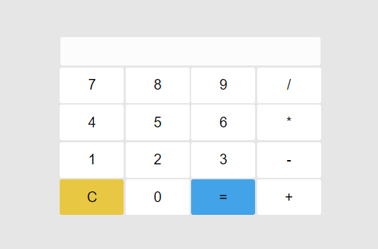

# Calculadora
#### Uma calculadora simpes feita com HTML, CSS e JavaScript
Para este projeto utilizei as linguagens HTML, CSS e JavaScript. Adotei um modelo mais claro, prezando a usabilidade e tornando algo mais agradável de ser visto. Para utilizá-la basta clicar nos números e botões e conferir o resultado.

O resultado ficou assim: 
 
Gostou? Então clona e se diverte.
